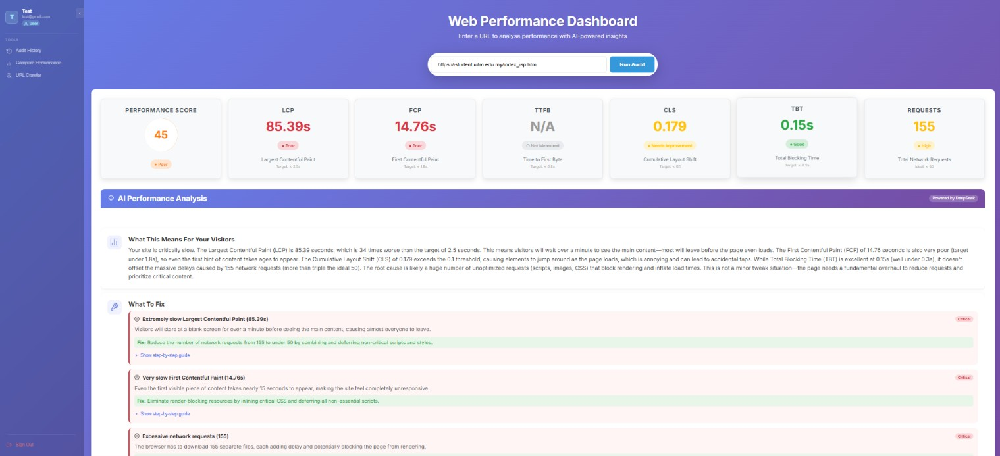
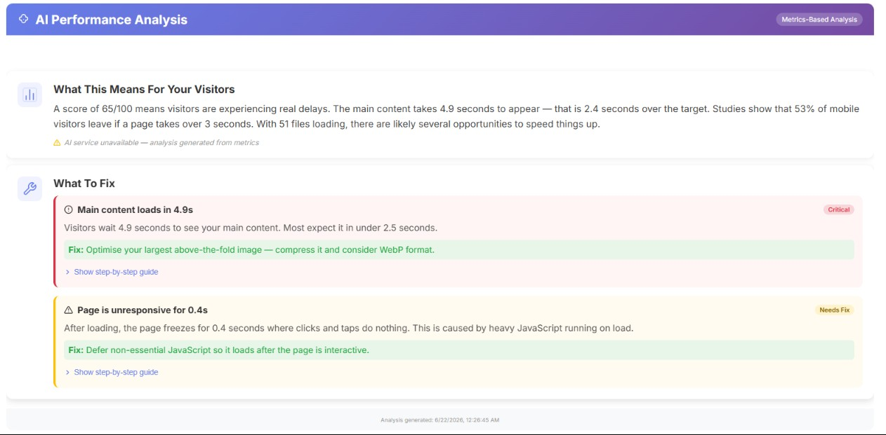
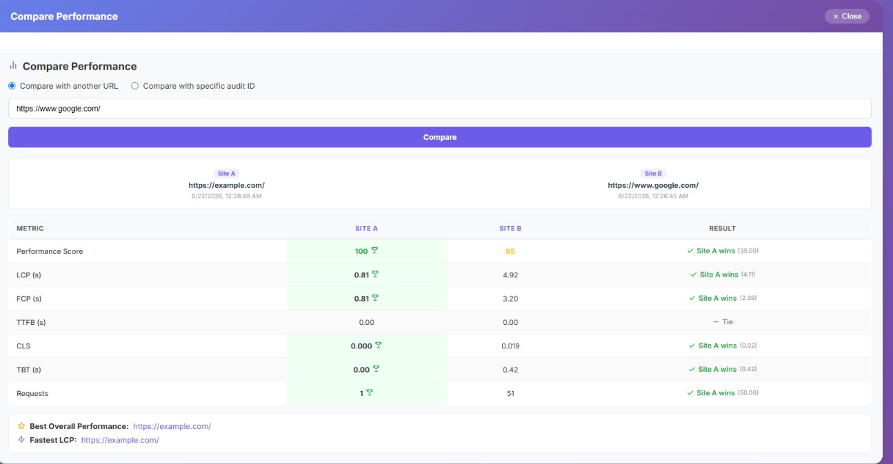

# Web Performance Dashboard

A web dashboard that runs **Google Lighthouse** performance audits on any website and uses **DeepSeek AI** to explain the results in plain language, with prioritised recommendations that non-technical users can act on.

> Final Year Project — *Web Performance Dashboard Using Google Lighthouse with DeepSeek API*
> Muhammad Alif Marzuki bin Rizuan · Bachelor of Computer Science (Hons.) Computer Networks · Universiti Teknologi MARA

---

## Contents

- [Features](#features)
- [Tech stack](#tech-stack)
- [How it works](#how-it-works)
- [Project structure](#project-structure)
- [Getting started](#getting-started)
- [Configuration](#configuration)
- [Available commands](#available-commands)
- [User roles](#user-roles)
- [API reference](#api-reference)
- [Adding a new feature](#adding-a-new-feature)
- [Troubleshooting](#troubleshooting)
- [Known limitations](#known-limitations)

---

## Features

| Feature | What it does |
|---|---|
| **Performance audit** | Runs Lighthouse in headless Chrome on a URL and reports the performance score, LCP, FCP, CLS, TBT, TTFB and request count, colour-coded against Google's targets. |
| **AI analysis** | Sends the metrics to DeepSeek (`deepseek-chat`) and shows a verdict, a plain-language summary and recommendation cards. If the AI is unavailable, a built-in rule-based analysis is used instead. |
| **Audited websites** | Every successful audit is saved. Users can search their history and re-open past results. |
| **Trend chart** | Line chart of score, LCP, FCP and TBT over time for a website (Chart.js). |
| **Compare performance** | Side-by-side comparison of two or more audits, highlighting the best performer. |
| **URL crawler** | Lists every link on a page, classified as internal or external. |
| **Export** | Download audits as JSON, CSV or PDF. |
| **Accounts & roles** | Login with JWT, three roles (user, moderator, admin), and admin tools to manage accounts and assign users to moderators. |

## Tech stack

| Layer | Technology |
|---|---|
| Frontend | React 19, Vite 6, Axios, Chart.js, jsPDF |
| Backend | Node.js, Express 5 |
| Auditing | Lighthouse 13 + chrome-launcher (headless Google Chrome) |
| AI | DeepSeek API via the OpenAI-compatible SDK |
| Database | SQLite (better-sqlite3) — a single file, no database server needed |
| Auth | JSON Web Tokens (jsonwebtoken) + bcrypt password hashing (bcryptjs) |

## How it works

```
 Browser (React + Vite, port 3000)
        │  /api/...  (forwarded by the Vite dev proxy)
        ▼
 Express API (port from server/.env)
        │
        ├── Audit queue ──► Lighthouse ──► headless Chrome ──► target website
        │                       │
        │                       └──► DeepSeek AI (or fallback analysis)
        │
        └── SQLite database (users, audits, websites, moderator assignments)
```

1. The user enters a URL and clicks **Run Audit**.
2. The server puts the request in a queue so only one Chrome instance runs at a time.
3. Lighthouse loads the page in headless Chrome and measures it.
4. The metrics go to DeepSeek, which returns a summary and recommendations. If the call fails or takes longer than 30 s, a metrics-based fallback is used.
5. The result is saved to SQLite under the user's account and sent back to the dashboard.





## Project structure

```
FYP-Project/
├── package.json              ← root scripts: npm run setup / dev / build / prod
├── scripts/
│   └── wait-for-server.js    ← used by npm run dev: starts the dashboard once the API answers
├── README.md
│
├── server/                   ← Express API
│   ├── server.js             ← entry point: mounts routes, starts the server
│   ├── config.js             ← ALL settings (reads server/.env) — start here
│   ├── .env.example          ← template for server/.env
│   ├── db/
│   │   └── database.js       ← SQLite tables and every SQL query
│   ├── middleware/
│   │   └── auth.js           ← login-token check and role checks
│   ├── routes/               ← one file per feature (URL → handler)
│   │   ├── auth.js           ← /api/auth/*   register, login, users, roles, assignments
│   │   ├── audit.js          ← /api/audit, /history, /trend, /audits, /websites, ...
│   │   ├── export.js         ← /api/export/*  JSON & CSV downloads
│   │   ├── compare.js        ← /api/compare
│   │   ├── crawler.js        ← /api/crawl/analyze
│   │   └── system.js         ← /api/test, /api/health
│   ├── services/             ← the actual work, independent of HTTP
│   │   ├── lighthouseService.js   ← runs Lighthouse, extracts metrics
│   │   ├── chromeSession.js       ← starts/stops headless Chrome, cleans its temp profiles
│   │   ├── deepseekService.js     ← AI prompt, response parsing, fallback analysis
│   │   ├── auditQueue.js          ← one audit at a time
│   │   └── crawlerService.js      ← fetches a page and collects its links
│   ├── utils/                ← small shared helpers
│   │   ├── access.js         ← who may see which audit
│   │   ├── csv.js            ← CSV formatting
│   │   └── url.js            ← URL validation
│   └── data/                 ← SQLite database file (created automatically, not in Git)
│
├── client/                   ← React dashboard (built with Vite)
│   ├── index.html            ← page shell; loads src/index.jsx
│   ├── vite.config.js        ← dev server (port 3000) + /api proxy to the PORT in server/.env
│   ├── public/               ← static files copied as-is (favicon, icons, manifest)
│   └── src/
│       ├── index.jsx         ← starts React
│       ├── App.jsx           ← shows LoginPage or Dashboard
│       ├── services/api.js   ← the ONLY file that calls the backend
│       ├── context/AuthContext.jsx ← logged-in user, login/logout, role helpers
│       └── components/       ← one component (+ CSS) per page or widget
│           ├── Dashboard.jsx        ← main layout + Run Audit page
│           ├── Sidebar.jsx          ← navigation (items depend on role)
│           ├── AIInsights.jsx       ← AI analysis cards
│           ├── MyAuditedWebsites.jsx, AuditHistory.jsx, PerformanceChart.jsx
│           ├── ComparisonView.jsx, UrlCrawler.jsx, ExportButton.jsx
│           ├── UserAuditManager.jsx ← User Audit Data (moderator/admin)
│           ├── AdminPanel.jsx       ← Manage Accounts (admin)
│           └── LoginPage.jsx, LoadingIndicator.jsx
│
└── temp/                     ← Chrome scratch files during audits (not in Git)
```

## Getting started

### Requirements

- **Node.js 20 or newer** — check with `node -v`
- **Google Chrome** installed (Lighthouse drives it in the background)
- A **DeepSeek API key** (optional — without one, the fallback analysis is used)

### 1. Install

From the project folder:

```bash
npm run setup
```

This installs the packages for the root, `server/` and `client/`.

### 2. Configure

Copy the example settings file and fill it in:

```bash
# Windows (PowerShell)
copy server\.env.example server\.env

# macOS / Linux
cp server/.env.example server/.env
```

Then open `server/.env` and set at least `JWT_SECRET` and `DEEPSEEK_API_KEY`. See [Configuration](#configuration).

### 3. Run

```bash
npm run dev
```

This starts both parts in one terminal and restarts the server automatically when you edit its code. The dashboard waits until the API is ready (loading Lighthouse can take 10–20 seconds on Windows), then starts — open it in your browser yourself:

| Part | Address |
|---|---|
| **Dashboard** — open this in your browser | http://localhost:3000 |
| API | http://localhost:5050/api (or whatever `PORT` is in `server/.env`) |

Check that the API is up: http://localhost:5050/api/test should return `"Server is working!"`.

### 4. Create the admin account

On a fresh database, **the first account you register automatically becomes admin**. Every account after that starts as a normal user, and an admin can change roles in **Manage Accounts**.

## Configuration

All settings live in **`server/.env`** and are read in one place, `server/config.js`.

| Variable | Required | Default | Purpose |
|---|---|---|---|
| `PORT` | – | `5050` | Port for the API. The React dev proxy reads this too, so it is the only place to change it. |
| `JWT_SECRET` | **Yes** | insecure placeholder | Secret used to sign login tokens. Use a long random string. |
| `DEEPSEEK_API_KEY` | – | *(empty)* | Enables AI analysis. Empty means the fallback analysis is used. |
| `CHROME_PATH` | – | auto-detect | Full path to Chrome if it isn't found automatically. |
| `DB_PATH` | – | `server/data/audit_history.db` | Location of the SQLite database. |
| `TEMP_DIR` | – | `temp/` | Scratch folder for Chrome's per-audit profiles (`temp/chrome-profiles/`). Cleaned automatically. |
| `NODE_ENV` | – | – | `production` makes the server also serve the built dashboard. |

Generate a strong `JWT_SECRET` with:

```bash
node -e "console.log(require('crypto').randomBytes(48).toString('hex'))"
```

## Available commands

Run these from the project root.

| Command | What it does |
|---|---|
| `npm run setup` | Install all packages (root, server, client) |
| `npm run dev` | Start server + dashboard for development |
| `npm run dev:server` | Start only the API (auto-restarts on changes) |
| `npm run dev:client` | Start only the dashboard |
| `npm run build` | Build the optimised dashboard into `client/build/` (Vite) |
| `npm run prod` | Build, then run everything from the server in production mode at `http://localhost:<PORT>` |

Inside `server/` you can also use `npm start` (plain run) and `npm run dev` (with nodemon).

## User roles

| Role | Can do |
|---|---|
| **User** (normal) | Run audits, see and export their own audits, compare, use the crawler |
| **Moderator** | Everything a user can, plus view, export and delete audits of users an admin has assigned to them |
| **Admin** | Everything, plus manage accounts and roles, assign users to moderators, and view server statistics |

Permissions are enforced on the server (`middleware/auth.js` and `utils/access.js`). The frontend only hides the menu items a role can't use.

## API reference

All endpoints are under `/api`. Unless marked **public**, send the login token in the header `Authorization: Bearer <token>`.

### Authentication — `routes/auth.js`

| Method | Endpoint | Access | Description |
|---|---|---|---|
| POST | `/api/auth/register` | public | Create an account (the first account becomes admin) |
| POST | `/api/auth/login` | public | Log in and receive a token |
| GET | `/api/auth/me` | any user | Current user's profile |
| GET | `/api/auth/users` | moderator+ | List all accounts |
| PUT | `/api/auth/users/:id/role` | admin | Change a user's role |
| DELETE | `/api/auth/users/:id` | admin | Delete a user and their audits |
| GET | `/api/auth/assignments` | admin | List moderator ↔ user assignments |
| POST | `/api/auth/assignments` | admin | Assign a user to a moderator |
| DELETE | `/api/auth/assignments/:moderatorId/:userId` | admin | Remove an assignment |
| GET | `/api/auth/stats` | admin | Server statistics |

### Audits — `routes/audit.js`

| Method | Endpoint | Access | Description |
|---|---|---|---|
| POST | `/api/audit` | any user | Run a Lighthouse audit. Body: `{ "url": "https://..." }` |
| GET | `/api/audit/:id` | owner / assigned moderator / admin | One audit |
| DELETE | `/api/audit/:id` | moderator+ (within scope) | Delete an audit |
| GET | `/api/history/:url` | any user | Your audit history for a URL |
| GET | `/api/trend/:url` | any user | Your chart data for a URL |
| GET | `/api/audits/mine` | any user | All your audits |
| GET | `/api/audits` | moderator+ | Other users' audits (moderators see assigned users only) |
| GET | `/api/website/:url/stats` | any user | Average, best and worst score for a URL |
| GET | `/api/websites` | moderator+ | Every audited website |
| GET | `/api/statistics` | admin | Overall audit statistics |
| GET | `/api/queue/status` | moderator+ | Whether an audit is running and how many are waiting |

### Export, compare, crawler, system

| Method | Endpoint | Access | Description |
|---|---|---|---|
| GET | `/api/export/json/:id` | owner / assigned moderator / admin | Audit as JSON |
| GET | `/api/export/csv/:id` | owner / assigned moderator / admin | Audit as CSV |
| GET | `/api/export/url/:url/csv` | any user | Your full history for a URL as CSV |
| POST | `/api/compare` | any user | Body: `{ "auditIds": [1, 2] }` or `{ "urls": ["...", "..."] }` |
| POST | `/api/crawl/analyze` | any user | Body: `{ "url": "https://..." }` — lists links on the page |
| GET | `/api/test` | public | Is the server running? |
| GET | `/api/health` | public | Server and database status |

URL parameters (`:url`) must be URL-encoded, e.g. `encodeURIComponent('https://example.com')`.

## Adding a new feature

The project is organised so each feature has a clear home. For example, adding an "SSL certificate check":

1. **Service** — `server/services/sslService.js`: the logic (connect, read the certificate, return results). No Express code here.
2. **Route** — `server/routes/ssl.js`: validate input, call the service, return JSON. Protect it with `verifyToken`.
3. **Mount** — one line in `server/server.js`: `app.use('/api', require('./routes/ssl'));`
4. **Database** (if results are saved) — add the table in `initializeDatabase()` and the queries in `server/db/database.js`.
5. **Settings** (if any) — add to `server/config.js` and document in `server/.env.example`.
6. **Frontend API call** — add a function to `client/src/services/api.js`.
7. **Page** — `client/src/components/SslCheck.jsx` (+ `.css`), then add it to the sidebar (`Sidebar.jsx`) and the page switch in `Dashboard.jsx`.
   Files that contain JSX (`<div>` etc.) must end in `.jsx`.
8. **Docs** — add the endpoint to the API reference above.

## Troubleshooting

| Problem | Cause and fix |
|---|---|
| Server prints `EACCES ... permission denied` | Windows has reserved that port (Hyper-V/WSL/Docker). Change `PORT` in `server/.env` (e.g. `5050`), or free the reservation from an **admin** terminal: `net stop winnat` then `net start winnat`. |
| Server prints `EADDRINUSE` | Another program, often an old server window, is using the port. Find it with `netstat -ano \| findstr :5050` and close it, or change `PORT`. |
| Login page says **"Could not connect to server"** | The API isn't running, or was started after the dashboard. Start it (`npm run dev`) and check `http://localhost:<PORT>/api/test`. If you changed `PORT`, restart `npm run dev` so the Vite proxy picks it up. |
| Error mentioning `NODE_MODULE_VERSION` or `better_sqlite3.node` | Node.js was updated after packages were installed. Run `npm rebuild better-sqlite3 --prefix server`, or delete `server/node_modules` and run `npm run setup`. |
| Audit returns score **0** with "Audit failed" | Chrome couldn't start or reach the site. Check Chrome is installed (or set `CHROME_PATH`), that the URL opens in a normal browser, and look at the server terminal for the error. |
| AI section says **"AI service unavailable"** | `DEEPSEEK_API_KEY` is missing or invalid, the account has no credit, or DeepSeek took longer than 30 s. The fallback analysis is shown instead. |
| `npm audit` reports vulnerabilities | Run `npm audit fix` in the folder it reports (root, `server` or `client`). **Never use `npm audit fix --force`** — it can install breaking major versions. |
| Forgot the admin password / want a clean start | Stop the server and delete `server/data/audit_history.db`. A new empty database is created on the next start, and the first account registered becomes admin. |

## Known limitations

- Chrome must be installed on the machine running the server.
- Results vary between runs of the same URL depending on network conditions, website load and machine speed.
- SQLite and the in-memory audit queue mean the app is designed for one server process. Queued audits are lost if the server restarts.
- Audits run one at a time, so several users auditing at once wait in line.

Muhammad Alif Marzuki Bin Rizuan
Final Year Project — Bachelor of Computer Science (Hons.) Computer Networks
Universiti Teknologi MARA Cawangan Melaka Kampus Jasin
Supervisor: Shahadan Bin Saad
